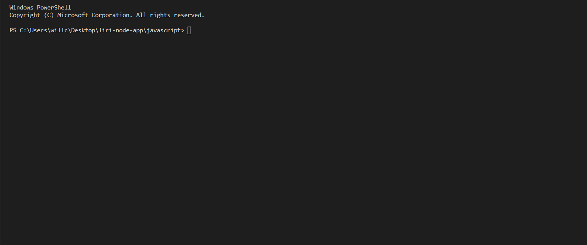
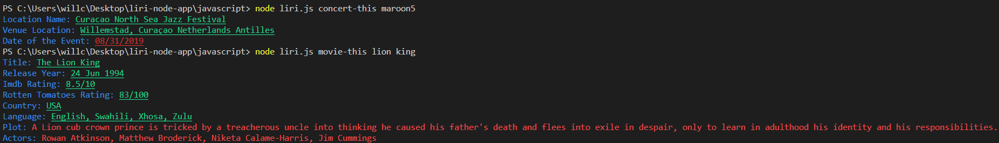
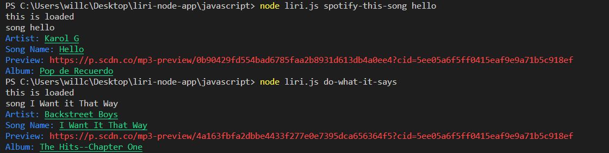
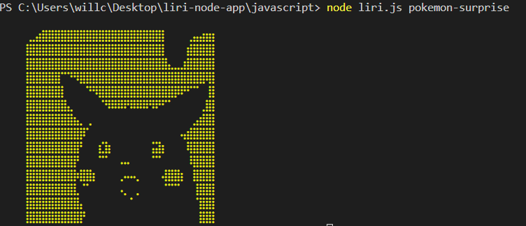

# Liri Node App

### Terminal

### Concert and Movie Commands

### Spotify and Do What It Says Commands

### Pokemon-Surprise Command

## Description

LIRI (Language Interpretation and Recognition Interface) is built like SIRI (Speech Interpretation and Recognition Interface) but uses terminal/gitbash command lines to execute processes. Here LIRI is built with Node.js and can perform the following functions:
1) Search concert events through the use of BandsInTown API
2) Search tracks through Spotify API
3) Search movies through OMDb API

## How to use LIRI

1) Open either gitbash or terminal and enter the starting command:
>node liri.js

2) Following the step 1 type one of the following commands to execute their function:
    #### Commands
    * concert-this --> to search concert events
    * spotify-this-song --> to search a specific song
    * movie-this --> to search a specific movie
    * do-what-it-says --> for something predefined into LIRI
    #### BONUS 
    * pokemon-surprise --> just do it :)

3) Type the name of the artist, song, movie you would like to search.

4) Your combined command line should look like the following:
>node liri.js movie-this lion king

# Technologies Used

* Javascript
* BandsInTown API
* Spotify API
* OMDb API
* Node.js 
* Moment.js

# Author

Phillip Chang